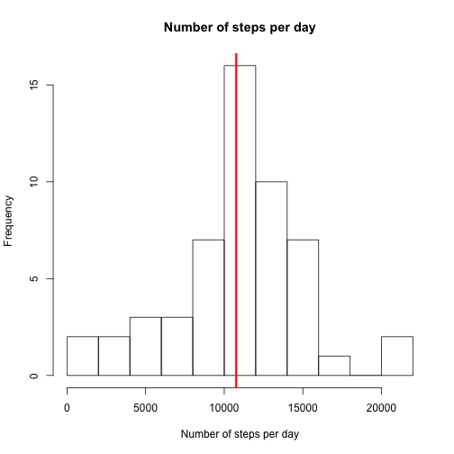
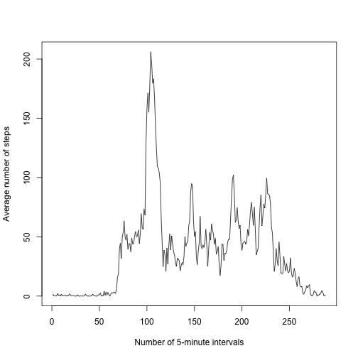
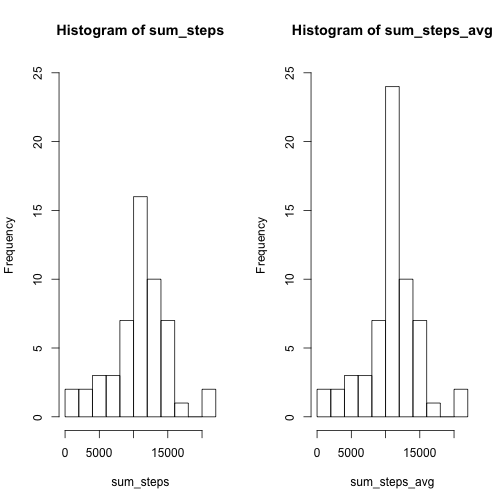

# Reproducible Research Assignment (Week 2)
## Introduction

It is now possible to collect a large amount of data about personal movement using activity monitoring devices such as a Fitbit, Nike Fuelband, or Jawbone Up. These type of devices are part of the "quantified self" movement -- a group of enthusiasts who take measurements about themselves regularly to improve their health, to find patterns in their behavior, or because they are tech geeks. But these data remain under-utilized both because the raw data are hard to obtain and there is a lack of statistical methods and software for processing and interpreting the data.

This assignment makes use of data from a personal activity monitoring device. This device collects data at 5 minute intervals through out the day. The data consists of two months of data from an anonymous individual collected during the months of October and November, 2012 and include the number of steps taken in 5 minute intervals each day.

The data for this assignment can be downloaded from the course web site:

Dataset: Activity monitoring data [52K]

The variables included in this dataset are:

**steps**: Number of steps taking in a 5-minute interval (missing values are coded as NA)

**date**: The date on which the measurement was taken in YYYY-MM-DD format

**interval**: Identifier for the 5-minute interval in which measurement was taken

The dataset is stored in a comma-separated-value (CSV) file and there are a total of 17,568 observations in this dataset.

## Loading and preprocessing the data
Unzip the dataset if it doesn't exist.

```r
filename <- "activity.zip"
if (!file.exists("activity.csv")) {
    unzip(filename)
}
```
Load the dataset to the data frame and inspect its structure.

```r
df <- read.csv("activity.csv")
head(df)
```

```
##   steps       date interval
## 1    NA 2012-10-01        0
## 2    NA 2012-10-01        5
## 3    NA 2012-10-01       10
## 4    NA 2012-10-01       15
## 5    NA 2012-10-01       20
## 6    NA 2012-10-01       25
```

```r
str(df)
```

```
## 'data.frame':	17568 obs. of  3 variables:
##  $ steps   : int  NA NA NA NA NA NA NA NA NA NA ...
##  $ date    : Factor w/ 61 levels "2012-10-01","2012-10-02",..: 1 1 1 1 1 1 1 1 1 1 ...
##  $ interval: int  0 5 10 15 20 25 30 35 40 45 ...
```
Transform the date column into a proper format.

```r
df$date <- as.Date(df$date)
str(df)
```

```
## 'data.frame':	17568 obs. of  3 variables:
##  $ steps   : int  NA NA NA NA NA NA NA NA NA NA ...
##  $ date    : Date, format: "2012-10-01" "2012-10-01" ...
##  $ interval: int  0 5 10 15 20 25 30 35 40 45 ...
```

## What is mean total number of steps taken per day?
For this part of the assignment, we are allowed to ignore the missing values in 
the dataset. So, let's get new data frame without missing values.

```r
df1 <- df[complete.cases(df), ]
head(df1)
```

```
##     steps       date interval
## 289     0 2012-10-02        0
## 290     0 2012-10-02        5
## 291     0 2012-10-02       10
## 292     0 2012-10-02       15
## 293     0 2012-10-02       20
## 294     0 2012-10-02       25
```
Get the total number of steps taken each day

```r
sum_steps <- tapply(df1$steps, df1$date, sum)
```
The mean and median total number of steps taken per day.

```r
mean(sum_steps)
```

```
## [1] 10766.19
```

```r
median(sum_steps)
```

```
## [1] 10765
```

```r
hist(sum_steps, 10, 
     xlab = "Number of steps per day", 
     main = "Number of steps per day")
abline(v = mean(sum_steps), 
       col = "red", 
       lw = 3)
```



## What is the average daily activity pattern?
the average number of steps taken in the 5-min interval, averaged across all days.

```r
avg_steps <- tapply(df1$steps, df1$interval, mean)
head(avg_steps)
```

```
##         0         5        10        15        20        25 
## 1.7169811 0.3396226 0.1320755 0.1509434 0.0754717 2.0943396
```

```r
plot(avg_steps, 
     type = "l", 
     xlab = "Number of 5-minute intervals", 
     ylab = "Average number of steps")
```



Checking:

```r
length(avg_steps)
```

```
## [1] 288
```
There are 24 * 60 = 1440 min per day. Therefore, it should be 

```r
1440 / 5
```

```
## [1] 288
```
5-minute intervals.

The 5-minute interval, which on average across all the days in the dataset, contains the maximum number of steps.

```r
avg_steps[avg_steps == max(avg_steps)]
```

```
##      835 
## 206.1698
```

## Imputing missing values
The total number of missing values and their fraction in the dataset.

```r
sum(is.na(df))
```

```
## [1] 2304
```

```r
sum(is.na(df)) / nrow(df)
```

```
## [1] 0.1311475
```
Create new data frame and imput missing values with the mean values for the corresponding 5-minute interval.

```r
na_indices <- which(is.na(df))
avg_steps_keys <- as.character(df[na_indices, 3])
dfAvg <- df
dfAvg[na_indices, 1] <- avg_steps[avg_steps_keys]
```
Checking:

```r
head(dfAvg)
```

```
##       steps       date interval
## 1 1.7169811 2012-10-01        0
## 2 0.3396226 2012-10-01        5
## 3 0.1320755 2012-10-01       10
## 4 0.1509434 2012-10-01       15
## 5 0.0754717 2012-10-01       20
## 6 2.0943396 2012-10-01       25
```

```r
sum(is.na(dfAvg))
```

```
## [1] 0
```
A histogram of the total number of steps taken each day

```r
sum_steps_avg <- tapply(dfAvg$steps, dfAvg$date, sum)
par(mfrow = c(1,2))
hist(sum_steps,     10, ylim = c(0, 25))
hist(sum_steps_avg, 10, ylim = c(0, 25))
```



The mean and median total number of steps taken per day.

```r
mean(sum_steps_avg)
```

```
## [1] 10766.19
```

```r
median(sum_steps_avg)
```

```
## [1] 10766.19
```

Imputing missing values has no impact on the mean value of steps per day and insignificantly increases the median.

```r
mean(sum_steps_avg) - mean(sum_steps)
```

```
## [1] 0
```

```r
median(sum_steps_avg) - median(sum_steps)
```

```
## [1] 1.188679
```

## Are there differences in activity patterns between weekdays and weekends?
Add needed columns and reshape the data frame.

```r
dfAvg$dow <- as.factor(weekdays(dfAvg$date))
dfAvg$day_type <- as.factor(ifelse((dfAvg$dow == "Saturday" | dfAvg$dow == "Sunday"), 
                                   "weekend", 
                                   "weekday"))
str(dfAvg)
```

```
## 'data.frame':	17568 obs. of  5 variables:
##  $ steps   : num  1.717 0.3396 0.1321 0.1509 0.0755 ...
##  $ date    : Date, format: "2012-10-01" "2012-10-01" ...
##  $ interval: int  0 5 10 15 20 25 30 35 40 45 ...
##  $ dow     : Factor w/ 7 levels "Friday","Monday",..: 2 2 2 2 2 2 2 2 2 2 ...
##  $ day_type: Factor w/ 2 levels "weekday","weekend": 1 1 1 1 1 1 1 1 1 1 ...
```

```r
library(reshape2)
dfAvgR <- aggregate(steps ~ interval + day_type, 
                    dfAvg,
                    mean)
head(dfAvgR)
```

```
##   interval day_type      steps
## 1        0  weekday 2.25115304
## 2        5  weekday 0.44528302
## 3       10  weekday 0.17316562
## 4       15  weekday 0.19790356
## 5       20  weekday 0.09895178
## 6       25  weekday 1.59035639
```

```r
tail(dfAvgR)
```

```
##     interval day_type       steps
## 571     2330  weekend  1.38797170
## 572     2335  weekend 11.58726415
## 573     2340  weekend  6.28773585
## 574     2345  weekend  1.70518868
## 575     2350  weekend  0.02830189
## 576     2355  weekend  0.13443396
```

```r
library(lattice)
xyplot(steps ~ interval | day_type, 
       data = dfAvgR, 
       type = "l", 
       layout = c(1, 2))
```


One can conclude from the figures that the test object has a peak walking activity in the morning on weekdays (perhaps he/she goes to work by foot in the morning and, being tired, take a public transportation in the evening). After that the walking activity is rather sluggish (perhaps the test object's job is just sitting in front of a PC in the office). In weekends the walking activity is more evenly distributed during the day indicating the absence of "must-do" walking (to the office, for inctance). 
